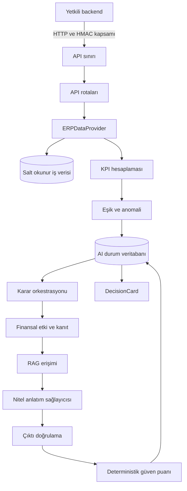
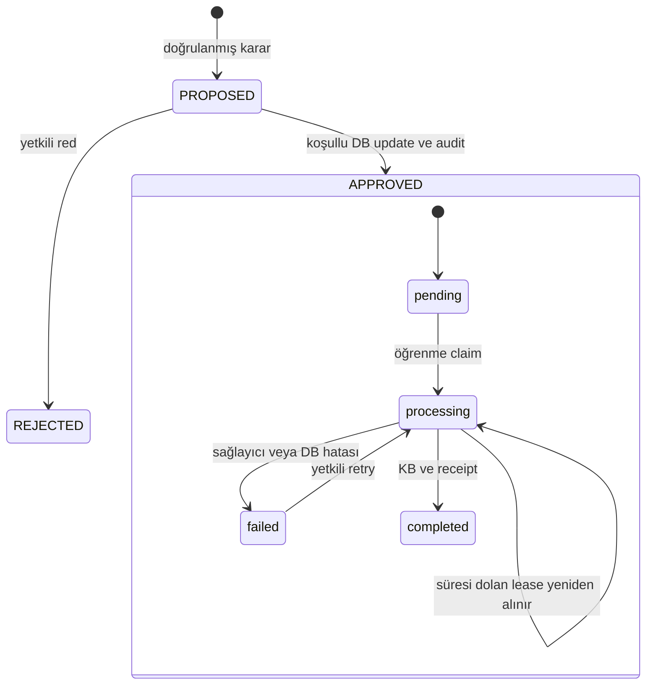

# MOERPY AI Service — Teknik devir ve doğrulama

Tarih: 14 Eylül 2026. Bu çalışma yalnız `ai-service/` içindedir. MOERPY frontend, Supabase fonksiyonları, migration'ları ve repository kök ayarları değiştirilmemiştir.

## Teslim edilen durum

Servis kaynakları, bağımsız test paketi, PostgreSQL üretim Compose tanımı, sentetik veri demosu ve kaynak arşivi hazırlama komutu vardır. Linux container üzerinde build ve HTTP yaşam döngüsü doğrulanmıştır. Ayrı PostgreSQL 16 test veritabanında gerçek sürücü ve SQL sorguları çalıştırılmıştır. Uzak production dağıtımı, müşteri ERP veritabanı bağlantısı ve ücretli model çağrısı bu çalışmada yapılmamıştır.

## Servisin mimarisi

Servis FastAPI ile sunulan modüler bir Python uygulamasıdır. İş verisini okuyan bağlantı ile AI durumunu yazan bağlantı ayrıdır. İstekler senkron uygulama fonksiyonlarına gider; kalıcı bir iş kuyruğu veya bağımsız öğrenme worker'ı yoktur. LLM ve embedding sağlayıcıları arayüzlerle ayrılmıştır.

### Katmanlar ve temel dosyalar

| Dosya / dizin | Sorumluluk ve sınır |
| --- | --- |
| `main.py` | ASGI uygulamasını dışa aktarır. |
| `app/core/runtime.py` | Startup, şema/KB kontrolleri, middleware, liveness/readiness, süreç sayaçları. |
| `app/core/config.py` | Ortam değişkenleri ve çalışma modu doğrulaması. AI state ile ERP'nin aynı DB'ye bağlanmasını reddeder. |
| `app/api/security.py` | HMAC doğrulama; tenant/company/actor/role kapsamını oluşturur. |
| `app/api/routes/v2.py` | KPI, analiz, eşik, karar ve lifecycle HTTP sözleşmesi. Prefix varsayılanı `/api/v1`; uygulama sürümü `2.0.0`. |
| `app/api/deps.py` | Request başına SQLAlchemy session ve sağlayıcı bağımlılıkları. |
| `app/data/models.py` | Canonical fact dataclass'ları, lineage ve tarih aralığı. |
| `app/data/providers/base.py` | Şirket, mağaza, ürün, satış, maliyet, stok ve fire okuma arayüzü. |
| `app/data/providers/postgres_v2.py` | Canonical/fact tablolarından tenant/company filtreli, read-only PostgreSQL okuma. `postgres_provider.py` import uyumluluğunu sağlar. |
| `app/data/providers/business_provider.py` | Sentetik büyük veri indeksini read-only SQLite ile okur; kayıt ve maliyet erişilebilirlik tarihlerini uygular. |
| `app/data/providers/fake_provider.py` | Deterministik test fixture sağlayıcısı; production modu bu sağlayıcıyı reddeder. |
| `app/data/business.py` | Manifest/hash/satır sayısı doğrulanmış CSV'lerden yeni sürümlü indeks oluşturur. Mevcut hedefi ezmez. |
| `app/kpi/calculation.py` | KPI matematiğinin tek Python uygulaması. `engine.py` dış import yüzeyidir. |
| `app/thresholds/` | Şirkete özel politika, yön/sıra doğrulama, seed ve deterministik eşik karşılaştırması. |
| `app/anomaly/` | Anomali şeması, severity, KPI/politika snapshot'ı, run hash'i, aktif sürüm kaydı. |
| `app/financial_impact/analyzer.py` | Metrikten finansal karar türüne sabit eşleme; gözlenen tutar ile senaryoyu ayırır. |
| `app/evidence/builder.py` | Aynı tenant/company/dönem/entity kapsamındaki geçerli KPI'lardan model kanıtı oluşturur. |
| `app/llm/` | Prompt, offline/live istemci, yapılandırılmış çıktı ve sayı kontrolü, kontrollü HTTP çağrısı. |
| `app/rag/` | Embedding, cosine erişimi, onaylı örnekler, özel şirket öğrenmesi, eski global öğrenme geçişi. |
| `app/confidence/engine.py` | Kanıt faktörlerinden sezgisel yeterlilik puanı. Doğruluk olasılığı değildir. |
| `app/decisions/service.py` | Karar üretimi ve onay/red/öğrenme orkestrasyonu. |
| `app/decisions/repository.py` | Karar kaydı, koşullu state geçişi ve audit olayının transaction'ı. |
| `app/db/` | SQLAlchemy engine/session ve yedekli eklemeli şema/veri geçişi. |
| `scripts/` | Test, demo yapılandırması, imzalı CLI, HTTP smoke, 24 aylık doğrulama, reindex ve kaynak paketleme. |
| `app/tests/` | Sayısal, API, scope, concurrency, provider, migration ve PostgreSQL kontrolleri. Üretim imajına alınmaz. |

### Veri ve hesaplama sözleşmesi

Kaynak doğrulamada duplicate fact ID, yanlış tenant/company, çözülemeyen ürün/mağaza, negatif/sonlu olmayan sayılar ve dönem dışı işlem reddedilir. Sayısal sonuç bilinmiyorsa `value=null` döner; anlamlı `issues` ve `coverage` bilgisi taşınır. `coverage`, ilgili hesabın kaynak yeterliliğidir; yükleme takvimindeki her günün tamamlandığına dair genel garanti değildir.

Gerçek COGS çözümü: doğrulanmış fatura satırı COGS → açık satır maliyeti → işlem tarihinde geçerli gözlenen maliyet → güncel ve çelişkisiz stok maliyeti. `cost_basis_known=False` ise tahmini fallback uygulanmaz. Onaylı bütçe ayrı filtrelenir; gerçekleşen COGS'un yerine kullanılamaz.

| KPI | Formül / koşul |
| --- | --- |
| `revenue` | Dönem net satış toplamı. Maliyet eksikliği geliri geçersiz yapmaz. |
| `cogs` | Bütün satışların çözülen gerçek maliyet toplamı; eksik satır varsa null. |
| `gross_profit` | Gelir − COGS. |
| `gross_margin_pct` | Brüt kâr / pozitif gelir × 100. |
| `branch_margin_gap_pct` | Hesaplanan şube marjlarının en yükseği − en düşüğü; birim yüzde puanıdır. Satışlı şubelerden birinin marjı eksikse kısmi karşılaştırma üretilmez. |
| `branch_margin_gap_try` | Marj farkı / 100 × en düşük marjlı şube geliri. Etiketli senaryodur. |
| `unit_cost_variance_pct` | (Gerçek COGS − onaylı bütçe COGS) / pozitif bütçe COGS × 100. Gerçek sağlayıcılarda onaylı bütçe kaynağı henüz yoktur. |
| `inventory_value` | Son snapshot'ın açık stok değeri veya miktar × maliyet toplamı. Eski/eksik değer null üretir. |
| `days_inventory_outstanding` | Dönem sonu stok / pozitif dönem COGS × dönem gün sayısı. Ortalama stok DIO'su değildir. |
| `working_capital_in_inventory_pct` | Stok / pozitif dönem geliri × 100. Sıfır COGS bu oranı engellemez. |
| `waste_value_try` | Doğrulanmış olay maliyeti veya olay tarihinde geçerli gözlenen maliyetle fire toplamı. |
| `waste_to_revenue_pct` | Fire maliyeti / pozitif dönem geliri × 100. |

API gelecekteki dönem bitişini kabul etmez. Açık ay için gerçek kesim tarihi gönderilmelidir. Business sağlayıcısı kendi manifest tarih kapsamını aşan aralığı da reddeder. Servis açık ayın kalan günlerini tahmin ederek doldurmaz.

### Analizden karara akış

1. `POST /analysis/run`: imzalı şirket doğrulanır, şirket eşikleri okunur, KPI'lar hesaplanır. `status=ok` dışındaki KPI'lar anomaliye çevrilmez.
2. Anomali severity'si warning–critical bandındaki mesafeden hesaplanır. KPI/eşik içeriğinin hash'i `run_id` olur. Aynı şirket/dönemin önceki anomalileri, aynı tenant kapsamında pasifleştirilir.
3. `POST /anomalies/{id}/generate-decision`: aktif kayıt gerekir. Karar ID'si anomali sürümü ve dile bağlıdır; aynı istek mevcut kartı döndürür.
4. Karar üretimi veriyi yeniden hesaplamaz; kaydedilmiş KPI ve politika snapshot'ını okur. Finansal eşleme, kanıt, RAG ve model çıktısı bu snapshot'a dayanır.
5. Model çıktısı Pydantic şemasından ve sayısal anlatım kontrolünden geçer. `summary` ve `problem_signal` koddan üretilir; karar türü ve departman kodla sabitlenir. `expected_impact` nitel tutulur.
6. Confidence kodda hesaplanır. Karar, evidence/RAG snapshot'ları ve model/prompt sürümleri birlikte kaydedilir.

### Onay ve öğrenme akışı

Onay/red yarışı koşullu update ile yönetilir. Karar onayı ve audit olayı aynı transaction içindedir. Öğrenme ayrı aşamadır: embedding sorunu onayı geri almaz; kart `learning_status=failed` gösterir. Beş dakikası dolan processing lease alınabilir. Eski worker'ın completion/failure yazımı claim zamanıyla koşulludur. Receipt aynı kararın tekrar sayılmasını önler.

Global KB şablonları salt okunur örneklerdir. Şirketin ilk onayı private kayıt oluşturur; sonraki benzer onaylar aynı tenant/company kaydının sayacını SQL ifadesiyle artırır. Global şablonlarda şirket listesi veya özel onay sayısı tutulmaz. `app/rag/migration.py`, eski receipt'leri sahipliği doğrulanabilen karar üzerinden özel kayda taşır.

### LLM ve RAG sınırları

Offline modda gerçek LLM çağrısı yoktur. Live mod açıkça seçilmelidir; yalnız API anahtarının bulunması modu değiştirmez. Live istemci OpenAI uyumlu `chat/completions` JSON yanıtını kullanır. Gövde doğrulaması ve nitel anlatım kontrolü model sağlayıcısından bağımsızdır.

RAG için varsayılan embedding 256 boyutlu deterministik hash vektörüdür. Bu yöntem anlamsal model kalitesi iddiası taşımaz. Live embedding ayrı seçilebilir. Arama aynı problem tipindeki onaylı global veya aynı şirketin özel kayıtları arasında cosine sıralamasıdır; varsayılan top-k 3, minimum benzerlik 0,15'tir. Özel öğrenmede duplicate eşiği 0,92'dir. Harici vector database kullanılmaz; vektörler SQL JSON alanında saklanıp bellekte sıralanır.

Model kimliği/boyutu uyuşmayan indeks kullanımını servis reddeder. `scripts/reindex.py`, bütün vektörler hazırlandıktan sonra tek transaction ile günceller; geçiş sırasında worker'lar kapalı tutulmalıdır.

### Güvenlik ve işletim

İmzalı kapsam tenant/company/actor/roles, HTTP method, tam request target, gövde SHA-256 ve zaman damgasını bağlar. Varsayılan süre penceresi ±120 saniyedir. Geçiş ve politika yazımı finance/admin/owner/executive yetkisi ister. Paylaşılan secret tek başına şirket yetkisi sağlamaz.

Varsayılan sınırlar: 32 KiB istek gövdesi, worker başına 8 eşzamanlı istek, sağlayıcı çağrısı başına 20 saniye bütçe ve en fazla 3 deneme, 1600 LLM çıktı token'ı, stok güncelliği 7 gün. Timeout bütçesi her `post_json` çağrısına aittir; birden fazla embedding/LLM çağrısı olan bütün isteğin tek toplam timeout'u değildir.

`/health` süreç sağlığıdır. `/ready` AI DB, auth yapılandırması ve ERP şirket erişimini kontrol eder. Model hesabının faturalandırma/erişim durumunu sürekli sınamaz. Production'da Swagger, ReDoc ve OpenAPI kapalıdır. Metrikler süreç içidir; restart'ta sıfırlanır.

## Düzeltilen ve testle doğrulanan durumlar

- Global RAG şablonuna özel şirket aktivitesi yazılması; legacy receipt'lerin özel kapsama taşınması.
- Öğrenme sayacının read/modify/write ile güncellenmesi ve süresi geçmiş worker'ın yeni claim sonucunu ezebilmesi.
- Gelir/stok verisinin ilgisiz maliyet/satış eksikliği yüzünden hatalı kalite durumu alması.
- Oranların lineage'ında payda, maliyet ve bütçe kaynağının eksik olması.
- Duplicate satış ID'sinin COGS sözlüğündeki değeri ezmesi.
- Çelişkili stok/maliyet fallback'inin kayıt sırasına bağlı sonuç üretmesi.
- Bütçe maliyetinin gerçekleşen maliyet gibi kullanılması.
- Gelecekteki stok/dönem ve veri kümesi kapsamı dışındaki aralığın hesaplamaya girmesi.
- Business kaynağında boş erişilebilirlik tarihi ile bilinmeyen değerin kullanılabilmesi; sayısal sıfırın eksik maliyet sayılması.
- Anomali pasifleştirme ve listelemede SQL tenant filtresinin eksikliği; karar listesindeki filtrelemenin pagination sonrasına kalması.
- Evidence/financial impact eşlemesinde yanlış tenant/dönem/entity veya geçersiz KPI kabulü.
- Production state/ERP DB karışıklığı, geçersiz API prefix ve ReDoc'un production'da açık kalması.

## Test kanıtı

| Kontrol | Sonuç |
| --- | --- |
| Başlangıçtaki servis paketi | 113 test geçti. |
| Yeni 13 hata senaryosu, düzeltme öncesi | 13'ü de başarısız oldu; sorunlar tekrarlandı. |
| Son Linux suite, business indeksi bağlı | 138 geçti; 3 PostgreSQL testi ayrı ortam gerektirdiği için atlandı. |
| Gerçek PostgreSQL 16, ayrı Compose DB | Atlanan 3 test geçti: adapter/KPI, read-only bağlantı, karar/onay/öğrenme. |
| 24 aylık büyük veri doğrulaması | Her ay gelir fatura başlıklarıyla uzlaştı; toplam 122 karar üretildi. |
| Üretim imajıyla business HTTP smoke | Readiness 200, imzasız erişim 401, yanlış tenant 404, idempotent üretim, onay ve öğrenme tamamlandı. |
| Container kısıtları | Root olmayan kullanıcı, salt okunur kök, read-only business mount, geçici test state'i. |

Test çalıştırmasında Starlette test istemcisinin AnyIO alias kullanımına ilişkin bir deprecation uyarısı vardır; test başarısızlığı değildir. Gerçek müşteri PostgreSQL şeması/izinleri ve gerçek model hesabı bu kanıtın kapsamı dışındadır.

## Temizlik ve paketleme

Kullanılmayan eski health router'ı, içi boş ve kullanılmayan `kpi/metrics` paketi, çağrılmayan `next_id`, mükerrer session generator ve kullanılmayan kart dönüştürme yardımcısı kaldırıldı. Python paket sınırlarını belirleyen `__init__.py` dosyaları korundu. Fixture ve testler doğrulamanın parçasıdır; pytest ve test modülleri runtime imajına alınmaz.

Yerel state DB'leri, business indeksi ve özel `.env` kaynak pakete/imaja dahil edilmez. Veri taşıyabilecek dosyalar gereksiz diye silinmez. Üretilmiş cache'ler temizlenebilir; yeniden oluşmaları normaldir. Kaynak arşivi `scripts/package.py` ile tekrar üretilebilir; iç manifest her kaynak dosyanın SHA-256 değerini içerir.

## Entegrasyon ve kalan sınırlar

MOERPY entegrasyonu [API_CONTRACT.md](API_CONTRACT.md) içindeki imzalı kapsam sözleşmesini uygulamalıdır. Bu işte MOERPY kodu değiştirilmedi. Servis, eski yalnız-token çağrılarına uyum sağlamak için yetkilendirmeyi gevşetmez.

Confidence kalibre edilmiş başarı olasılığı değildir. İnsan onayı gerçekleşmiş tasarruf kanıtı değildir. Gerçek budget baseline kaynağı, günlük yükleme tamamlanma bilgisi, kampanya/stok yokluğu düzeltilmiş talep modeli ve üretim ölçeğinde değerlendirme ayrıca gereklidir. PostgreSQL entegrasyon testi gerçek sürücüyü ve adapter'ın kullandığı minimal canonical şemayı doğrular; müşteri şemasının tüm migration'larını uyguladığı iddia edilmez.

Eski veritabanında global öğrenme varsa backup alınarak `python -m app.db.migrate` çalıştırılmalıdır. Bu çalışmadaki migration testleri disposable DB kullanmıştır; kullanıcının mevcut karar DB'si otomatik dönüştürülmemiştir. Uzak dağıtım, DNS/TLS ve MOERPY bağlantısı tamamlanmış olarak sunulmaz.
